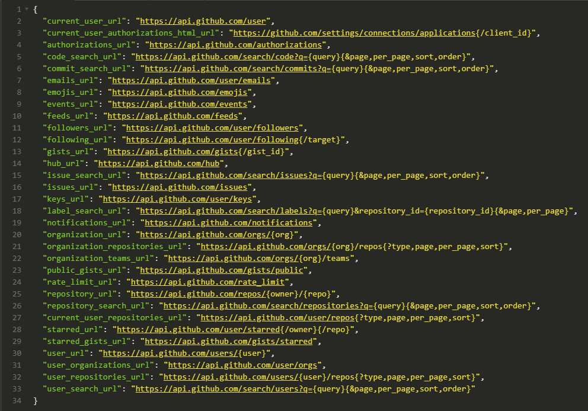

# [4-6]

# REST APIs

---

## REST

_or **RE**presentational **S**tate **T**ransfer._

---

## API

_or **A**plication **P**rogramming **I**nterface_

Something that allows one piece of software to talk to another.

---

- REST is a type of API.
- All REST services are APIs, but not all APIs are REST.
- REST is a set of rules/standards/guidelines for how to build a web API.

---

## Fine. But what is it, really?

It's essentially a set of RESTful principles.

---

### REST is a client-server architecture.

- The client and the server both have different concerns.
  - The server stores and/or manipulates information and makes it available to the user in an efficient manner.
  - The client takes that information and displays it to the user and/or uses it to perform subsequent requests for information.

_This separation of concerns allows both the client and the server to evolve independently as it only requires that the interface stays the same._

---

### REST is stateless.

- That means the communication between the client and the server always contains **all** the information needed to perform the request.
- There is no session state in the server, it is kept entirely on the client's side.
- If access to a resource requires authentication, then the client needs to authenticate itself with every request.

---

### REST is cacheable.

- The client, the server and any intermediary components can all cache resources in order to improve performance.

---

### REST provides a uniform interface between components.

- This simplifies the architecture, as all components follow the same rules to speak to one another.
- It also makes it easier to understand the interactions between the different components of the system.

---

### REST is a layered system.

- Individual components cannot see beyond the immediate layer with which they are interacting.
- This allows components to be independent and thus easily replaceable or extendable.

---

### More Opinions

- It should use web standards where they make sense
- It should be friendly to the developer and be explorable via a browser address bar
- It should be simple, intuitive and consistent to make adoption not only easy but pleasant
- It should provide enough flexibility to power majority of the Enchant UI
- It should be efficient, while maintaining balance with the other requirements

---

### More Practically...

- Separate your API into logical resources.
- These resources are manipulated with the proper methods.

| Method   | Description                                     |
| -------- | ----------------------------------------------- |
| `GET`    | retrieve resource from the server               |
| `POST`   | create resource on the server                   |
| `PUT`    | modify/update the entire resource on the server |
| `PATCH`  | applies a _partial_ update to a resource        |
| `DELETE` | deletes a resource                              |

_Basically, follow `CRUD` (Create, Read, Update, Delete)_

---

### Example

- `GET /tickets` - Retrieves a list of tickets
- `GET /tickets/12` - Retrieves a specific ticket
- `POST /tickets` - Creates a new ticket
- `PUT /tickets/12` - Updates ticket #12 (sends a complete object for #12 to server)
- `PATCH /tickets/12` - Partially updates ticket #12 (sends only data to update)
- `DELETE /tickets/12` - Deletes ticket #12

---

### What About Related Data?

If a resources can only exist _within_ a resource, it should be part of the endpoint.

<a href='https://www.instagram.com/developer/endpoints/users/#get_users_self' target='_blank'>Instagram Endpoints</a>

---

---

## HTTP Codes

- `200` OK — Show that the operation performed is successful.
- `201` CREATED — When you use POST method to create a new resource.
- `202` ACCEPTED — Acknowledge the request sent to the server.
- `400` BAD REQUEST — When client-side input validation fails.
- `401` UNAUTHORIZED / `403` FORBIDDEN — When the user or the system is not authorized to perform an operation.
- `404` NOT FOUND — When looking for certain resource and it is not available in the system.
- `500` INTERNAL SERVER ERROR — Should never be thrown explicitly but might occur if the system fails.
- `502` BAD GATEWAY — When the server received an invalid response from the upstream server.
